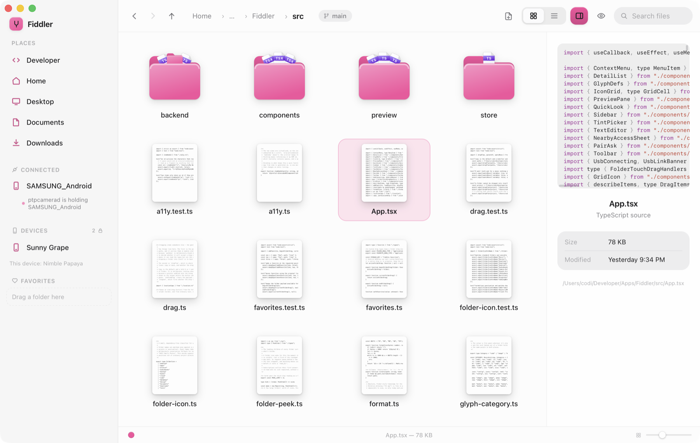
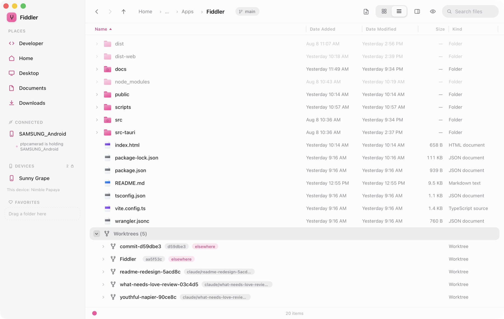

<div align="center">


# Fiddler

### A file browser that knows what a repository is.

Real thumbnails instead of grey document glyphs. A preview pane that costs what
you can see, not what the file is. Git as a quiet dot beside what changed —
and the one answer Finder has never had: **your worktrees, on screen**.

**[Try it in your browser →](https://files.c0di.com)**



</div>

---

## The worktrees you can't see

Linked worktrees end up wherever the tool that made them decided to put them:

```
~/Developer/n64/Mine64/.claude/worktrees/pause-tabs   ← hidden dotfolder in the repo
~/.codex/worktrees/e217/world_of_warblox              ← nowhere near the repo
/private/tmp/gitto-icon-deploy.9IbjSw                 ← ephemeral, already prunable
```

Finder shows none of them. Fiddler reads `.git/worktrees/*` straight off disk and
hangs them under the repo they belong to — tagged with their branch, `elsewhere`
when they live outside the repo tree, and `missing` when the folder is gone and
`git worktree prune` would tidy it up.

<div align="center">

</div>

## What you get

- **Thumbnails that mean something.** `main.rs` is drawn as a page of code.
  `notes.md` is drawn as a page of prose. PDFs show page one, folders show what's
  inside them, photos reuse the preview already in the file.
- **Git without a git panel.** A dot for modified, staged, untracked, conflicted.
  The branch on the folder. Ignored files dimmed rather than hidden.
- **Two views, both dense.** Big icons or a sortable list you can twist open.
  Type letters to jump. `space` for Quick Look.
- **The whole verb list, in whichever hand.** Copy, cut, paste, duplicate,
  rename, trash, share, `⌘Z` to take it back, multi-select, drag onto folders,
  favourites, name search and content search — with a progress bar you can
  cancel on the long ones. A pointer clicks, double-clicks and right-clicks; a
  finger taps and long-presses; the verbs behind them are the same list.
- **Nearby devices.** Another Mac or Android on the same Wi-Fi appears in the
  sidebar. Pairing is one tap here and one **Allow** over there; being visible on
  the network authorises nothing on its own.
- **A phone on a cable.** Plug in an Android device and browse it over MTP, with
  real thumbnails for the photos and videos on it.

## Fast on purpose

- **One git pass per repo, not per folder.** `git status --porcelain=v2 -z` runs
  once, is parsed into a path→code map with per-directory rollups, and is cached
  until an fsevents watcher says otherwise. `--ignored=traditional` collapses
  `node_modules/` to one entry instead of listing everything inside it.
- **Highlighting that tracks the viewport, not the file.** One linear scan stores
  a byte per line; only the sixty lines on screen are ever tokenised. A lockfile
  opens like a text file, because to Fiddler it is one.
- **Each preview takes the cheapest route macOS offers.** ImageIO decodes
  straight to thumbnail size, Core Text lays text out as a page, Core Graphics
  rasterises PDF pages at the size they'll be shown — all in-process. Quick Look
  is kept for what only it can do: video, Keynote, Sketch, Office.
- **Both views are virtualized**, and thumbnails render off the critical path in
  four lanes, ordered outward from the middle of the viewport, cached on disk by
  path, mtime, size and requested pixels.

## Keys

| | |
|---|---|
| `⌘1` `⌘2` | Icon / list view |
| `⌘[` `⌘]` `⌘↑` | Back, forward, enclosing folder |
| `space` | Quick Look — rendered markdown, highlighted source, paged PDFs |
| `⇧⌘P` | Preview pane |
| `⇧⌘.` | Show hidden files |
| type letters | Jump to the first matching name |
| `↵` `⌘↵` | Rename / open |
| `⌘C` `⌘X` `⌘V` | Copy, cut, paste |
| `⌘D` `⌘Z` | Duplicate, undo |
| `⌘⌫` | Move to Trash |
| `⇧⌘N` `⌘N` | New folder / new text file |

## Run it

```bash
npm install && npm run tauri dev
```

Computer-use screenshots need a registered `.app`, which `tauri dev` doesn't
produce — build a debug bundle instead:

```bash
npx tauri build --debug --bundles app && open src-tauri/target/debug/bundle/macos/Fiddler.app
```

## Three targets, one interface

`src/ipc.ts` is the seam. `@backend` resolves at build time to `src/backend/tauri.ts`
(Rust over IPC) or `src/backend/web.ts` (a virtual filesystem in the tab), and
nothing above that line knows which it got. `src/platform.ts` holds the capability
flags that decide what each build offers.

**macOS** — the full app: git, worktrees, nearby devices, USB, Quick Look, Trash.

**Web** — [files.c0di.com](https://files.c0di.com), the same React front end.
Browsing, both views, previews, editing, search. **Open Folder…** mounts a real
folder read/write via the File System Access API (Chromium), and anything dragged
onto the window is read in any browser. Nothing is uploaded — there is no server
behind the page. Deliberately no git: a tab has no repository, and a file browser
showing invented status is one you can't trust the rest of.

```bash
npm run dev:web      # vite, port 1420
npm run build:web    # → dist-web
npm run deploy       # build, then wrangler deploy
```

**Android / Samsung DeX** — the wide keyboard-and-pointer layout, and the
narrow one held in a hand. Browsing, git status, previews, and a full-screen
text editor. Deletions are permanent, with a confirmation, because Android
gives Fiddler no system Trash.

A finger gets the same three verbs a pointer has, spelled its own way. **Long
press** takes an item — a haptic tick and a selection while the finger is still
down — and from there a **tap toggles** rather than opens, which is the whole
of multi-select: press once, then tap the rest. The status bar becomes the
action bar, with the overflow opening the very same menu a right-click opens.
A press on something already selected goes straight to that menu.

**Back** walks the ladder Escape walks on the desktop — menu, editor, Quick
Look, selection — and then the folder you came from, rather than closing the
app. **Share** hands the selection to Android's chooser, from the menu, the
action bar, or Quick Look.

Which hand is holding it is worked out from the last pointer down rather than
at build time, so DeX with a mouse on a monitor behaves like a desktop and the
same build on the panel behaves like a phone.

Fiddler is also registered for **Open with** and the share sheet, for the types
Quick Look can draw. Picking it doesn't put the document on a blank screen — it
opens the folder the file lives in, selects it, and raises Quick Look, so you
get the file and where it came from. Where the sending app has no real file
behind its URI — Drive, Photos, a mail attachment — the bytes are copied into
Fiddler's cache first, and it's that copy you land on.

```bash
npm run tauri -- android build --debug --target aarch64
```

## Inside

```
src-tauri/src/
  git/discover.rs   repo + worktree discovery, straight off disk, no subprocess
  git/status.rs     porcelain-v2 parser, rollups
  fs_scan.rs        directory listing, natural sort
  thumb*.rs         thumbnail cache, four lanes, text drawn via Core Text
  page.rs           PDF pages rasterised at any size
  transfer.rs       copy and move, progress and cancellation
  mtp/              Android devices over USB
  peers.rs          nearby devices, pairing, access
  watcher.rs        fsevents, filtered and debounced
src/
  store/tree.ts     navigation, sorting, list flattening
  preview/          markdown parser + highlighter
  components/       IconGrid, DetailList, PreviewPane, QuickLook, Sidebar, …
```

Tests: `cargo test` in `src-tauri/`, and `npm test` for the parser, highlighter
and web backend — Node runs those TypeScript files directly, so there's no test
framework to install.

## Not yet

Tabs, column view, and dragging in and out of Finder. Quick Look renders
documents itself rather than hosting the system's previews, so formats outside
the list above show a still image instead.
